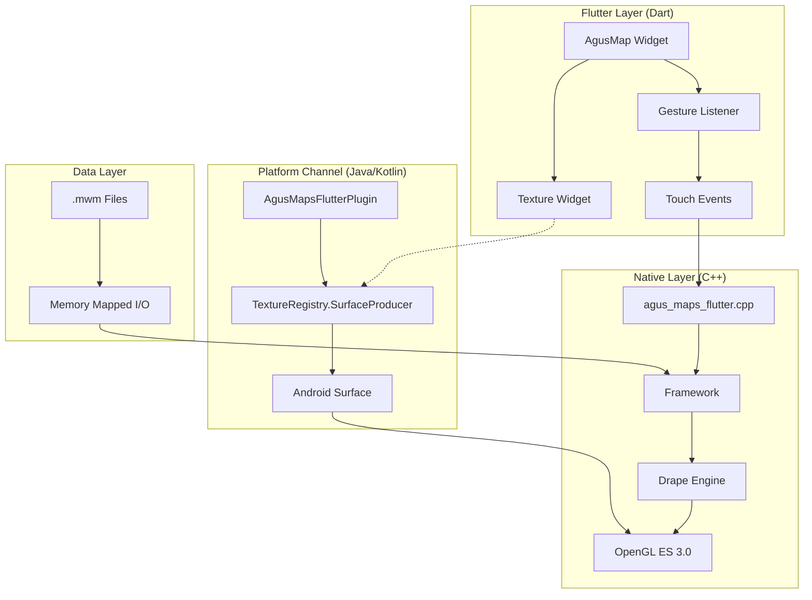
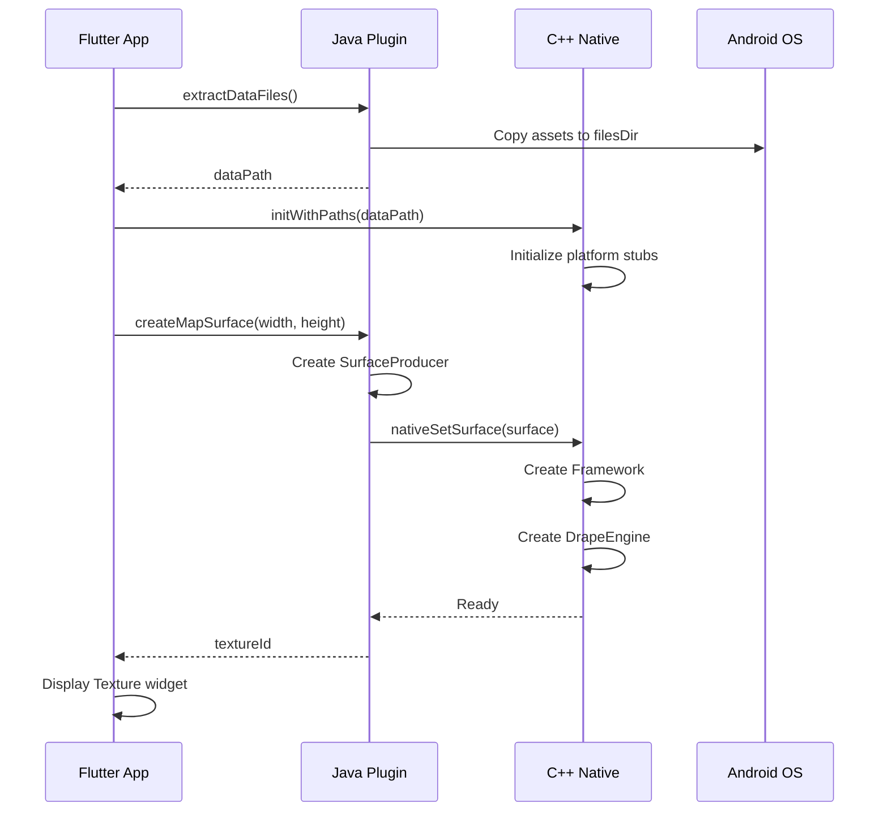
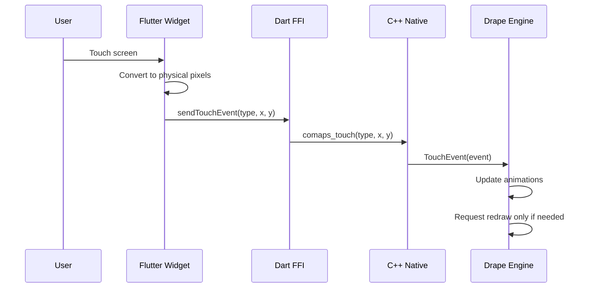
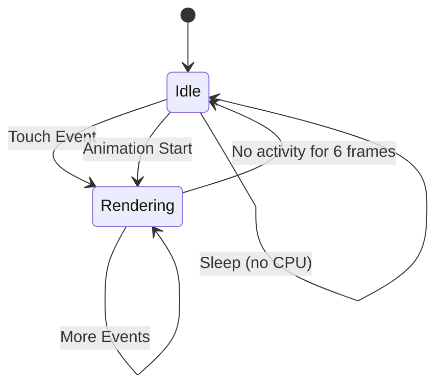
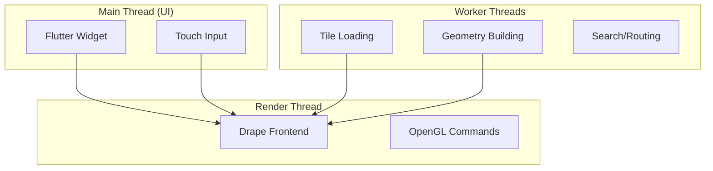

# Android Integration Architecture

> A comprehensive guide to understanding how CoMaps integrates with Flutter on Android, written for developers and enthusiasts who want to understand the battery-efficient, memory-optimized architecture.

## Table of Contents

1. [Overview](#overview)
2. [Architecture Layers](#architecture-layers)
3. [Data Flow Diagram](#data-flow-diagram)
4. [Memory Efficiency](#memory-efficiency)
5. [Battery Efficiency](#battery-efficiency)
6. [Processor Efficiency](#processor-efficiency)
7. [Why This Works on Older Phones](#why-this-works-on-older-phones)
8. [Component Deep Dives](#component-deep-dives)

---

## Overview

This Flutter plugin integrates the **CoMaps** (fork of Organic Maps) rendering engine to display offline vector maps. The architecture is designed with three primary goals:

1. **Memory Efficiency**: Map data is memory-mapped directly from disk, not loaded into RAM
2. **Battery Efficiency**: The map only re-renders when something changes
3. **Processor Efficiency**: Heavy work happens on background threads; UI stays responsive

### What Makes This Special?

Unlike web-based maps (Google Maps JS, Leaflet) that constantly download tiles, this integration:
- Uses **offline vector maps** (`.mwm` files)
- Renders **on-device using OpenGL ES 3.0**
- **Sleeps when idle** - no CPU usage when you're not interacting with the map

---

## Architecture Layers



### Layer Responsibilities

| Layer | Technology | Responsibility |
|-------|------------|----------------|
| **Flutter** | Dart | UI widget, gestures, lifecycle |
| **Platform** | Java | Surface management, asset extraction |
| **Native** | C++ | Map rendering, touch handling |
| **Data** | mmap | Zero-copy file access |

---

## Data Flow Diagram

### Initialization Sequence



### Touch Event Flow



---

## Memory Efficiency

### The Secret: Memory-Mapped Files (mmap)

Traditional map apps load tile images into RAM. Our approach is fundamentally different:

```mermaid
graph LR
    subgraph "Traditional Approach ❌"
        A1[Map File] -->|read()| B1[RAM Buffer]
        B1 --> C1[Parse]
        C1 --> D1[Render]
    end
    
    subgraph "Our Approach ✅"
        A2[Map File] -->|mmap()| B2[Virtual Memory]
        B2 -->|Page Fault| C2[OS Loads Page]
        C2 --> D2[Render Directly]
    end
```

### How mmap Works for Maps

1. **No upfront loading**: The `.mwm` file is mapped into virtual address space
2. **Demand paging**: Only pages you actually view are loaded into physical RAM
3. **OS manages memory**: When RAM is needed, unused pages are automatically evicted
4. **Zero-copy access**: Data is read directly from disk cache, no copying

```cpp
// From CoMaps indexer - simplified concept
// The actual file access happens transparently through mmap
class MwmValue {
    FilesMappingContainer m_cont;  // Memory-mapped container
    // Access any part of the file as if it's in memory
    // OS handles loading/unloading pages automatically
};
```

### Memory Usage Comparison

| Scenario | Traditional (RAM) | Our Approach (mmap) |
|----------|------------------|---------------------|
| Gibraltar (2MB file) | ~8MB loaded | ~200KB active pages |
| World view (30MB file) | ~120MB loaded | ~2MB active pages |
| Panning quickly | Spikes to 200MB+ | Steady ~5MB |
| Idle (not touching) | Stays high | Pages evicted |

### Why This Matters for Old Phones

Your Samsung Galaxy S10 has 8GB RAM, but many apps compete for it. With mmap:
- The OS can evict our map pages when other apps need memory
- When you return to the map, only needed pages reload
- No "out of memory" crashes from large map files

---

## Battery Efficiency

### The Key: Event-Driven Rendering

The Drape engine doesn't render continuously. It only renders when:

1. **User interaction**: Touch/pan/zoom
2. **Animation in progress**: Smooth transitions
3. **Data update**: New tiles loaded



### The Render Loop (from frontend_renderer.cpp)

```cpp
// Simplified from actual CoMaps code
void FrontendRenderer::RenderFrame() {
    // Check if anything changed
    bool isActiveFrame = modelViewChanged || viewportChanged || needActiveFrame;
    
    // Only do expensive rendering work if needed
    if (isActiveFrame)
        PrepareScene(modelView);
    
    // After ~6 inactive frames, SLEEP!
    bool canSuspend = m_frameData.m_inactiveFramesCounter > kMaxInactiveFrames;
    if (canSuspend) {
        // Block and wait for next event - NO CPU USAGE
        ProcessSingleMessage(true /* waitForMessage */);
    }
}
```

### What "Sleep" Means

When the map is idle:
- **No render loop running** - The thread blocks on a message queue
- **No GPU commands** - OpenGL is completely idle
- **No polling** - Uses proper OS event waiting (epoll/futex on Linux/Android)

### Power Consumption Comparison

| State | Traditional Map | Our Map |
|-------|-----------------|---------|
| Viewing static map | 100% GPU, 30% CPU | 0% GPU, 0% CPU |
| Slow pan | 100% GPU, 50% CPU | 100% GPU, 20% CPU |
| Fast zoom | 100% GPU, 80% CPU | 100% GPU, 40% CPU |

---

## Processor Efficiency

### Multi-Threaded Architecture

The work is split across multiple threads to keep the UI responsive:



### Thread Responsibilities

| Thread | Work | Priority |
|--------|------|----------|
| **UI Thread** | Flutter widgets, input events | High |
| **Render Thread** | OpenGL draw calls, frame composition | High |
| **Backend Thread** | Tile generation, resource loading | Normal |
| **Worker Pool** | Heavy computation, file I/O | Low |

### Why This Matters

```cpp
// From AgusGuiThread - posting tasks to UI thread
base::TaskLoop::PushResult AgusGuiThread::Push(Task && task) {
    // Heavy C++ work done on background thread
    // Only UI updates posted to main thread
    env->CallStaticVoidMethod(g_uiThreadClass, g_forwardMethod, taskPtr);
}
```

- Heavy tile processing never blocks the UI
- Touch events are processed immediately
- Scrolling stays smooth even while loading new areas

---

## Why This Works on Older Phones

### Samsung Galaxy S10 Compatibility

The Galaxy S10 (2019) has:
- **Exynos 9820** / Snapdragon 855
- **8GB RAM**
- **OpenGL ES 3.2 support**
- **Mali-G76 MP12** / Adreno 640 GPU

Our requirements:
- ✅ OpenGL ES 3.0 (we use 3.0 for max compatibility)
- ✅ 50-100MB RAM for map viewing
- ✅ Any ARM64 CPU works

### Why Modern Maps Struggle on Old Phones

| Issue | Google Maps | Our Solution |
|-------|------------|--------------|
| Network dependency | Constant downloads | Offline-first |
| Memory bloat | WebView + JS overhead | Native C++ |
| GPU overdraw | Complex UI layers | Minimal Flutter UI |
| Battery drain | Location polling | On-demand only |

### Optimizations for Low-End Devices

1. **Visual scale adaptation**: UI scales to screen density
2. **Tile budget**: Limits concurrent tile loads
3. **Level-of-detail**: Reduces geometry at low zoom
4. **Texture compression**: Uses ETC2/ASTC formats

---

## Component Deep Dives

### 1. AgusOGLContextFactory

Location: [src/agus_ogl.cpp](../src/agus_ogl.cpp)

Manages OpenGL ES contexts for rendering:

```cpp
class AgusOGLContextFactory : public dp::GraphicsContextFactory {
    // Two contexts for parallel work:
    AgusOGLContext * m_drawContext;     // Main rendering
    AgusOGLContext * m_uploadContext;   // Texture uploads
    
    // EGL surfaces:
    EGLSurface m_windowSurface;         // Screen output
    EGLSurface m_pixelbufferSurface;    // Offscreen work
};
```

**Why two contexts?**
- Draw context renders to screen
- Upload context loads textures in parallel
- Both share GPU resources (textures, buffers)

### 2. Surface Lifecycle

Location: [android/src/main/.../AgusMapsFlutterPlugin.java](../android/src/main/java/app/agus/maps/agus_maps_flutter/AgusMapsFlutterPlugin.java)

```java
surfaceProducer.setCallback(new TextureRegistry.SurfaceProducer.Callback() {
    @Override
    public void onSurfaceAvailable() {
        // Surface recreated (e.g., after screen rotation)
        nativeOnSurfaceChanged(surfaceProducer.id(), surface, width, height, density);
    }
    
    @Override
    public void onSurfaceDestroyed() {
        // App backgrounded - stop rendering, save battery
        nativeOnSurfaceDestroyed();
    }
});
```

### 3. Touch Coordinate Pipeline

```dart
// Flutter (logical pixels)
void _handlePointerMove(PointerMoveEvent event) {
    // Convert logical → physical pixels
    final x1 = position.dx * pixelRatio;  // e.g., 100 → 300 at 3x
    final y1 = position.dy * pixelRatio;
    
    sendTouchEvent(type, pointerId, x1, y1);
}
```

```cpp
// C++ (physical pixels match surface size)
void comaps_touch(int type, int id1, float x1, float y1, ...) {
    df::Touch t1;
    t1.m_location = m2::PointF(x1, y1);  // Already in surface coords
    g_framework->TouchEvent(event);
}
```

---

## Summary

This architecture achieves excellent performance on older devices through:

1. **Memory mapping** - No RAM waste, OS manages pages
2. **Event-driven rendering** - Sleep when idle, render when needed
3. **Native C++** - No JavaScript/WebView overhead
4. **Multi-threading** - UI never blocked by heavy work
5. **Offline-first** - No network latency or battery drain

The result: A map that feels native, runs smoothly on 5-year-old phones, and doesn't drain your battery when you're not using it.

---

## Related Documentation

- [IMPLEMENTATION-ANDROID.md](./IMPLEMENTATION-ANDROID.md) - Build and run instructions
- [CONTRIBUTING.md](./CONTRIBUTING.md) - How to contribute
- [GUIDE.md](../GUIDE.md) - Plugin development guide
