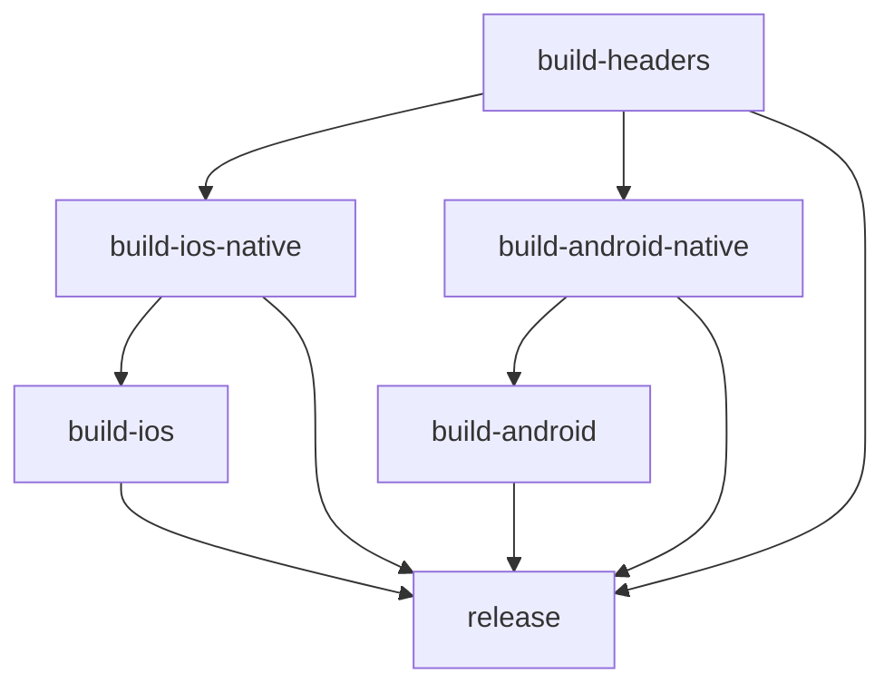

# CI/CD Implementation Plan: Split Native Build + Shared Headers

This document outlines the implementation plan for splitting the Android build process and introducing a shared headers workflow, mirroring the iOS approach for distributing pre-built native libraries via GitHub Releases.

## Overview

### Goals

1. **Split Android build** into two stages: native library build and example app build
2. **Factor out headers bundling** into a dedicated shared workflow
3. **Distribute native libraries via GitHub Releases** (no authentication required for consumers)
4. **Enable plugin consumers** to download pre-built binaries instead of compiling from source

### Artifact Naming Convention

| Artifact | Description | Platforms |
|----------|-------------|-----------|
| `agus-headers.tar.gz` | Shared C++ headers | All platforms |
| `agus-binaries-ios.zip` | iOS XCFramework | iOS (device + simulator) |
| `agus-binaries-android.zip` | Android static libs | Android (arm64-v8a, armeabi-v7a, x86_64) |

### Script Naming Convention

| Current Name | New Name | Purpose |
|--------------|----------|---------|
| `bundle_ios_headers.sh` | `bundle_headers.sh` | Bundle shared headers (platform-agnostic) |
| `build_ios_xcframework.sh` | `build_binaries_ios.sh` | Build iOS XCFramework |
| (new) | `build_binaries_android.sh` | Build Android static libs |
| `download_ios_xcframework.sh` | `download_libs.sh` | Download headers + platform binaries |

## Pipeline Architecture

### Build-Release Pipeline Structure

```
build-headers (runs first, produces agus-headers.tar.gz)
├── build-ios-native (depends on build-headers)
│   └── build-ios (depends on build-ios-native)
├── build-android-native (depends on build-headers)
│   └── build-android (depends on build-android-native)
└── release (depends on all builds)
```

### Workflow Dependencies



## Implementation Steps

### Phase 1: Headers Workflow

#### Step 1.1: Rename `bundle_ios_headers.sh` → `bundle_headers.sh`

- Make script platform-agnostic
- Change output path from `ios/CoMaps-headers.tar.gz` to `build/agus-headers.tar.gz`
- Remove iOS-specific references in comments
- Keep same logic for bundling CoMaps + third-party headers

#### Step 1.2: Create `build-headers` workflow in `bitrise.yml`

```yaml
build-headers:
  summary: Bundle CoMaps headers for all platforms
  description: |
    Fetches CoMaps source, applies patches, builds Boost headers,
    and packages all C++ headers into agus-headers.tar.gz.
    This artifact is shared across iOS, Android, and future platforms.
  steps:
    - git-clone
    - Set Environment Variables (COMAPS_TAG)
    - Restore CoMaps Cache
    - Fetch CoMaps Source
    - Save CoMaps Cache
    - Apply CoMaps Patches
    - Build Boost Headers
    - Bundle Headers (bundle_headers.sh)
    - Prepare Headers Artifact
    - deploy-to-bitrise-io (intermediate file: HEADERS_PATH)
```

### Phase 2: iOS Build Refactoring

#### Step 2.1: Rename `build_ios_xcframework.sh` → `build_binaries_ios.sh`

- Update output from `ios/Frameworks/CoMaps.xcframework` to `build/agus-binaries-ios/CoMaps.xcframework`
- Update comments to reflect new naming

#### Step 2.2: Refactor `build-ios-xcframework` → `build-ios-native` workflow

- Add `depends_on: build-headers`
- Remove headers bundling steps (now in `build-headers`)
- Update script call to `build_binaries_ios.sh`
- Output `agus-binaries-ios.zip` (containing `CoMaps.xcframework`)
- Update env var from `XCFRAMEWORK_PATH` to `IOS_BINARIES_PATH`

### Phase 3: Android Native Build

#### Step 3.1: Create `build_binaries_android.sh`

New script that:
1. Iterates over ABIs: `arm64-v8a`, `armeabi-v7a`, `x86_64`
2. Invokes CMake with Android NDK toolchain for each ABI
3. Builds CoMaps static libraries (`.a` files)
4. Packages all libraries into `build/agus-binaries-android.zip`

Structure of `agus-binaries-android.zip`:
```
agus-binaries-android/
├── arm64-v8a/
│   ├── libmap.a
│   ├── libplatform.a
│   ├── libcoding.a
│   ├── libgeometry.a
│   ├── libbase.a
│   ├── libdrape.a
│   └── libdrape_frontend.a
├── armeabi-v7a/
│   └── (same .a files)
└── x86_64/
    └── (same .a files)
```

#### Step 3.2: Create `build-android-native` workflow

```yaml
build-android-native:
  summary: Build CoMaps native libraries for Android
  description: |
    Builds CoMaps C++ libraries for Android (all ABIs) and packages
    them into agus-binaries-android.zip for distribution.
  depends_on:
    - build-headers
  steps:
    - git-clone
    - Set Environment Variables (COMAPS_TAG, NDK_VERSION, CMAKE_VERSION)
    - Install Android SDK Components (NDK & CMake)
    - Restore CoMaps Cache
    - Fetch CoMaps Source
    - Save CoMaps Cache
    - Apply CoMaps Patches
    - Build Boost Headers
    - Build Android Native Libraries (build_binaries_android.sh)
    - Prepare Android Binaries Artifact
    - deploy-to-bitrise-io (intermediate file: ANDROID_BINARIES_PATH)
```

### Phase 4: Download Script Unification

#### Step 4.1: Rename `download_ios_xcframework.sh` → `download_libs.sh`

Update script to:
1. Accept platform argument: `download_libs.sh <platform>` (ios, android)
2. Download `agus-headers.tar.gz` (always)
3. Download platform-specific binaries (`agus-binaries-ios.zip` or `agus-binaries-android.zip`)
4. Extract to appropriate locations
5. Support dual-mode detection (in-repo vs external consumer)

### Phase 5: Consumer Integration

#### Step 5.1: Update `android/build.gradle`

Add Gradle task to:
1. Detect if `thirdparty/comaps` exists (in-repo build)
2. If not, run `download_libs.sh android`
3. Pass `-DUSE_PREBUILT_COMAPS=ON` to CMake

#### Step 5.2: Update `src/CMakeLists.txt`

Add `USE_PREBUILT_COMAPS` option:
```cmake
option(USE_PREBUILT_COMAPS "Use pre-built CoMaps libraries" OFF)

if(USE_PREBUILT_COMAPS)
    # Link pre-built static libraries
    set(PREBUILT_DIR "${CMAKE_CURRENT_SOURCE_DIR}/../android/prebuilt/${ANDROID_ABI}")
    # ... link libraries from PREBUILT_DIR
else()
    # Existing source build
    add_subdirectory(../thirdparty/comaps build/comaps)
endif()
```

#### Step 5.3: Update `ios/agus_maps_flutter.podspec`

Change `prepare_command` to call `download_libs.sh ios`:
```ruby
s.prepare_command = <<-CMD
    ./scripts/download_libs.sh ios
CMD
```

Update artifact references to new names.

### Phase 6: App Build Workflow Refactoring

#### Step 6.1: Refactor `build-ios` workflow

- Add `depends_on: build-ios-native`
- Pull headers from intermediate files (or download)
- Pull iOS binaries from intermediate files (or download)
- Build example app using pre-built native libs

#### Step 6.2: Refactor `build-android` workflow

- Add `depends_on: build-android-native`
- Pull headers from intermediate files (or download)
- Pull Android binaries from intermediate files (or download)
- Remove CoMaps source fetch steps (no longer needed)
- Build example app using pre-built native libs

### Phase 7: Release Workflow Update

#### Step 7.1: Update `release` workflow

Update `files_to_upload`:
```yaml
files_to_upload: |-
    $AAB_PATH
    $APK_PATH
    $BUILD_INFO_PATH
    $HEADERS_PATH           # agus-headers.tar.gz
    $IOS_BINARIES_PATH      # agus-binaries-ios.zip
    $ANDROID_BINARIES_PATH  # agus-binaries-android.zip
    $IOS_SIMULATOR_APP_PATH
```

Update release notes to document new artifact names.

#### Step 7.2: Update `build-release` pipeline

```yaml
build-release:
  workflows:
    build-headers: {}
    build-ios-native:
      depends_on:
        - build-headers
    build-android-native:
      depends_on:
        - build-headers
    build-ios:
      depends_on:
        - build-ios-native
    build-android:
      depends_on:
        - build-android-native
    release:
      depends_on:
        - build-headers
        - build-ios-native
        - build-android-native
        - build-ios
        - build-android
```

## Environment Variables

### Build Environment

| Variable | Default | Description |
|----------|---------|-------------|
| `COMAPS_TAG` | `v2025.12.11-2` | CoMaps version tag |
| `FLUTTER_VERSION` | `3.27.0` | Flutter SDK version |
| `NDK_VERSION` | `27.2.12479018` | Android NDK version |
| `CMAKE_VERSION` | `3.22.1` | CMake version |
| `IOS_DEPLOYMENT_TARGET` | `15.6` | iOS minimum version |
| `BUILD_TYPE` | `Release` | Build configuration |

### Intermediate File Variables

| Variable | Artifact |
|----------|----------|
| `HEADERS_PATH` | `agus-headers.tar.gz` |
| `IOS_BINARIES_PATH` | `agus-binaries-ios.zip` |
| `ANDROID_BINARIES_PATH` | `agus-binaries-android.zip` |
| `AAB_PATH` | `agus-maps-android.aab` |
| `APK_PATH` | `agus-maps-android.apk` |
| `IOS_SIMULATOR_APP_PATH` | `agus-maps-ios-simulator.app.zip` |

## Consumer Usage

### For Plugin Consumers (pub.dev, git dependency)

When adding `agus_maps_flutter` to a Flutter project:

1. **iOS**: `pod install` triggers `download_libs.sh ios`
   - Downloads `agus-headers.tar.gz` and `agus-binaries-ios.zip`
   - Extracts to `ios/Headers/` and `ios/Frameworks/`

2. **Android**: Gradle sync triggers download task
   - Downloads `agus-headers.tar.gz` and `agus-binaries-android.zip`
   - Extracts to `android/prebuilt/` and `android/headers/`
   - CMake links pre-built libraries

### For Plugin Developers (in-repo build)

When working on the plugin:
- `thirdparty/comaps` exists → builds from source
- Can still use `FORCE_DOWNLOAD=true ./scripts/download_libs.sh <platform>` to test pre-built flow

## Future Platform Support

The architecture supports adding new platforms:

| Platform | Build Script | Artifact |
|----------|--------------|----------|
| Linux | `build_binaries_linux.sh` | `agus-binaries-linux.tar.gz` |
| Windows | `build_binaries_windows.sh` | `agus-binaries-windows.zip` |
| macOS | `build_binaries_macos.sh` | `agus-binaries-macos.tar.gz` |

Headers (`agus-headers.tar.gz`) remain shared across all platforms.

## Migration Notes

### Breaking Changes

1. Artifact names change:
   - `CoMaps.xcframework.zip` → `agus-binaries-ios.zip`
   - `CoMaps-headers.tar.gz` → `agus-headers.tar.gz`

2. Script names change:
   - `download_ios_xcframework.sh` → `download_libs.sh`
   - `build_ios_xcframework.sh` → `build_binaries_ios.sh`
   - `bundle_ios_headers.sh` → `bundle_headers.sh`

3. Workflow names change:
   - `build-ios-xcframework` → `build-ios-native`

### Backward Compatibility

During transition, the `release` workflow could upload artifacts with both old and new names for one release cycle to prevent breaking existing consumers.

## Checklist

- [ ] Create `build-headers` workflow
- [ ] Rename `bundle_ios_headers.sh` → `bundle_headers.sh`
- [ ] Rename `build_ios_xcframework.sh` → `build_binaries_ios.sh`
- [ ] Refactor `build-ios-xcframework` → `build-ios-native` workflow
- [ ] Create `build_binaries_android.sh`
- [ ] Create `build-android-native` workflow
- [ ] Rename `download_ios_xcframework.sh` → `download_libs.sh`
- [ ] Update `android/build.gradle` for dual-path detection
- [ ] Update `src/CMakeLists.txt` with `USE_PREBUILT_COMAPS` option
- [ ] Update `ios/agus_maps_flutter.podspec`
- [ ] Refactor `build-android` workflow
- [ ] Refactor `build-ios` workflow
- [ ] Update `release` workflow
- [ ] Update `build-release` pipeline
- [ ] Test end-to-end pipeline
